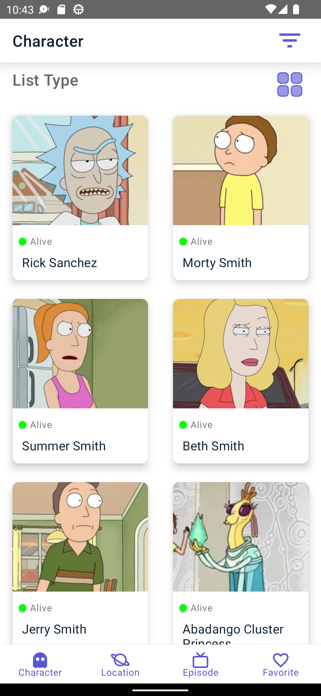
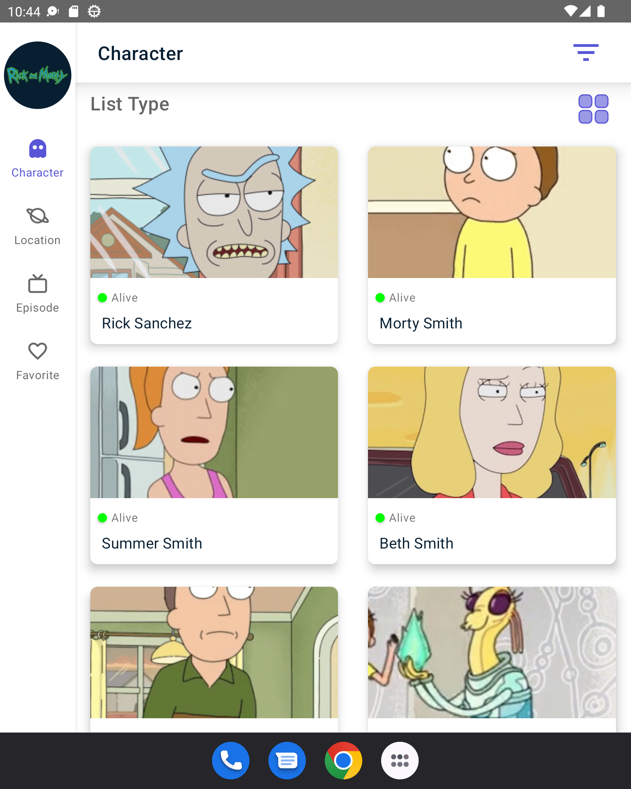
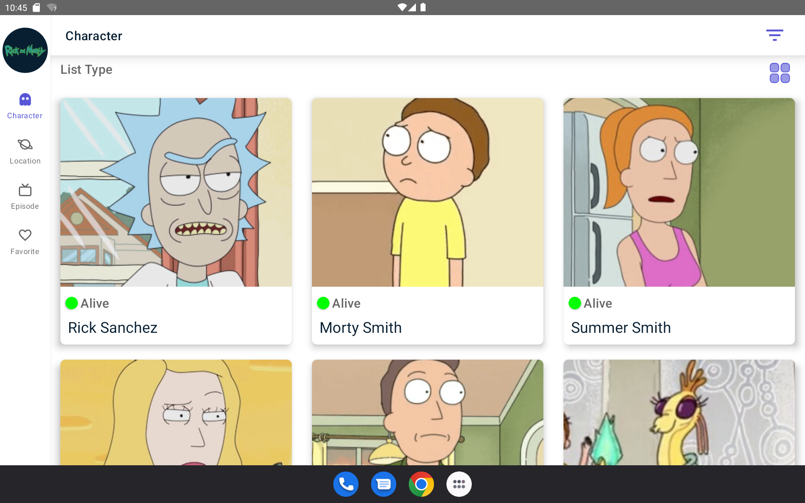

# Rick And Morty
Rick and Morty demonstrates modern Android development with Hilt, Coroutines, Flow on MVVM architecture.

## App Screens

  
## Projects Features

- Kotlin based [Coroutines](https://github.com/Kotlin/kotlinx.coroutines) + Flow for asynchronous.
- MVVM (Model, View, ViewModel)
- DataBinding
- [Hilt](https://developer.android.com/training/dependency-injection/hilt-android) - Hilt is a dependency injection library for Android that reduces the boilerplate of doing manual dependency injection in your project
- [Paging](https://developer.android.com/topic/libraries/architecture/paging/v3-overview) - The Paging library makes it easier for you to load data incrementally and gracefully within your app's UI
- [Navigation](https://developer.android.com/guide/navigation) 
- [Retrofit](https://github.com/square/retrofit) - A type-safe HTTP client for Android and Java. 
- [Moshi](https://github.com/square/moshi) - A modern JSON library for Android, Java and Kotlin
- [Timber](https://github.com/JakeWharton/timber) - Timber is a logger with a small, extensible API which provides utility on top of Android's normal Log class.
- [Coil](https://github.com/coil-kt/coil) - An image loading library for Android backed by Kotlin Coroutines.

# Demo

# Large Screen Support

### Phone

### Foldelable - Unfolded

### Tablet

# MAD Score

## Open API

Rick And Morty using [Rick And Mory API](https://rickandmortyapi.com/)

## Find this repository useful? 
Don't forget give a star. ⭐

  
